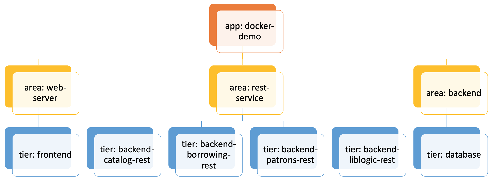

# Kubernetes deployment

This directory includes YAML files needed for a kubernetes deployment. To deploy use ```kubectl apply -f .```. After the deployment process completes wait for the Pods to initialized and then use your browser to view the projects.
> If you are running the setup for the first time then images will be pulled from a public repository on [docker hub](https://hub.docker.com/u/eyalabraham).
> You must wait for all images to be pulled and for all pods to be in the ```Running``` state.
> You can check pod status by running ```kubectl get pods -l app=docker-demo```

## Laptop vs Kubernetes cluster deployment

The microservices application is deployed in exactly the same way in both environments. If you are running the deployment on your laptop point your browser at http://localhost:30080/ to access the main application web page. If you have a running [Kubernetes cluster](../doc/k8s-cluster-setup.md), the deployment will expose the application at http://<host.domain>:30080/. Replace the host.domain with your cluster's IP address or host/domain name. When running the application in a properly configured cluster, your host name or IP can be any of the master or worker nodes.

## Deployments, Services and Pods topology

All deployments, services, and pods are tagged with labels and you can filter them with the ```-l``` command line switch of ```kubectl```. Refer to the diagram below for details:
