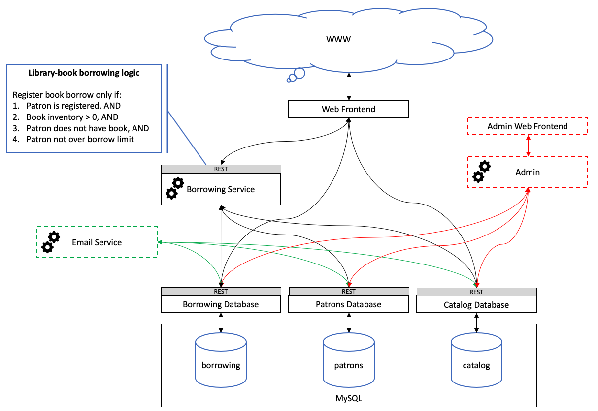

# Microservices, Containers, and Persistent Volume storage demo
This project contains a microservices architecture application. The application is a very (very) simple web-based book lending app for a fictitious library. The project is intended as a demonstration for a [Microservices architecture](https://microservices.io/) within a Containerized solution using [Docker Containers](https://www.docker.com/) and [Kubernetes](https://kubernetes.io/) orchestration.
The end goal is to deploy the demo with [persistent volumes](https://docs.docker.com/storage/) utilizing a [CSI driver](https://beta.docs.docker.com/ee/ucp/kubernetes/use-csi/), in order to demonstrate the ability to persist database data on an external block or file storage system.

## Important note!
This project was designed with extreme simplicity in mind, specifically to be used as a demo or a teaching/learning tool. Many liberties were taken with the architecture and the design in order to eliminate complexities such as security and scalability. This is not a secure, production quality, application but rather a learning or teaching tool for Microservices and Container technology; possible also a reasonably good starting point for a beginner or unexperienced programmer.
**Use appropriately and have fun!**

## Using the demo
- Make sure you have the latest Docker and docker-compose installed!
- Pull the repository or download and extract the zip file from GitHub into a new directory on your system.
- Copy the ```sample.env``` file into a new file named ```.env```
```
cp sample.enc .enc
```
- Optional, change the MySQL root password in the ```sample.env``` file.
- Build the images and bring up the app services:
```
docker-compose up --detach --build 
```
- Allow all services to start (there is hard-coded delay of 20sec to allow the database service time to initialize)
- Point your web browset at: http://0.0.0.0:8000/ to access the library's web page.
- Use the canned set of users in the ```mysql/patrons_demo.csv``` file to log into the library and borrow books
- Display container logs during run time and watch activity when selecting web page links
```
docker-compose logs --follow
```
- Shutdown and clean up
```
docker-compose down
```

## Testing
Wherever possible, internal ports where exposed to use as test points for the REST API endpoints. To test intermediate points within the application use the ```curl``` CLI command to "inject" REST requests directly into the running services. Suggested tests are listed in the TESTME.md files found in each of the services' directories. See the ```docker-compose.yml``` file for local port numbers under the ```ports:``` tag for each service.

## Services architecture



| Service              | Framework     | Description                                          |
|----------------------|---------------|------------------------------------------------------|
| Frontend             | Python/Django | Expose and HTTP server for accessing the application |
| Catalog database     | Python/Flask  | Back end book catalog database                       |
| Patrons database     | Python/Flask  | Back end patrons' registry database                  |
| Borrowing database   | Python/Flask  | Back end borrowing transaction database              |
| Borrowing service    | Python/Flask  | Library book borrowing logic                         |

## REST interface definitions and Microservices
See the [design.md](design.md) file

## Dependencies
- Python3 (version 3.6.8)
- MySQL database server (version 5.7.27)

### requirements.txt for Services
```
$ pip freeze
certifi==2019.9.11
chardet==3.0.4
Click==7.0
Flask==1.1.1
idna==2.8
itsdangerous==1.1.0
Jinja2==2.10.3
MarkupSafe==1.1.1
mysql-connector-python==8.0.18
protobuf==3.10.0
requests==2.22.0
six==1.13.0
urllib3==1.25.7
Werkzeug==0.16.0
```

### requirements.txt for Frontend
```
$ pip freeze
certifi==2019.9.11
chardet==3.0.4
Django==2.2.7
idna==2.8
pytz==2019.3
requests==2.22.0
sqlparse==0.3.0
urllib3==1.25.7
```

## Resources
[Django web framework](https://www.djangoproject.com/), [Flask web framework](https://www.fullstackpython.com/flask.html)
[Python REST API CRUD Example using Flask and MySQL](https://www.roytuts.com/python-rest-api-crud-example-using-flask-and-mysql/), [MySQL Server on Ubuntu](https://support.rackspace.com/how-to/installing-mysql-server-on-ubuntu/), [Designing a RESTful API with Python and Flask](https://blog.miguelgrinberg.com/post/designing-a-restful-api-with-python-and-flask), [HTTP Status Codes](https://www.restapitutorial.com/httpstatuscodes.html)

