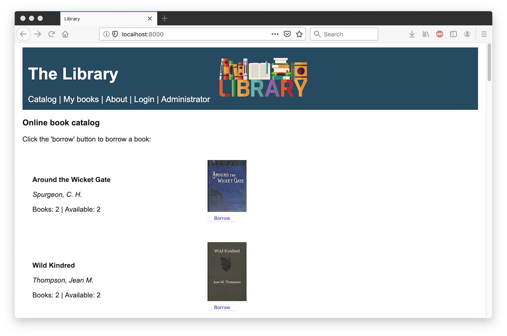
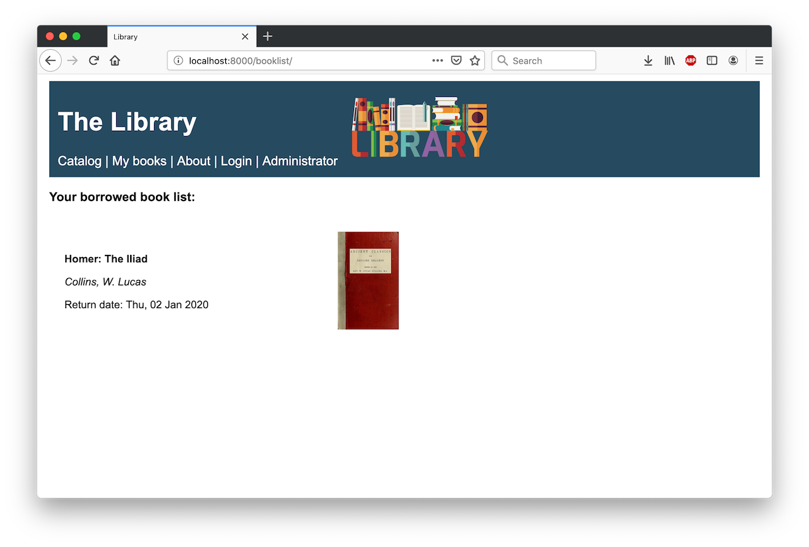
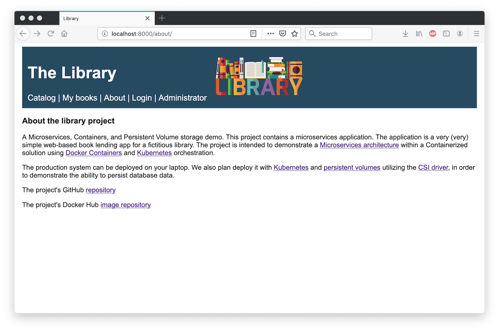
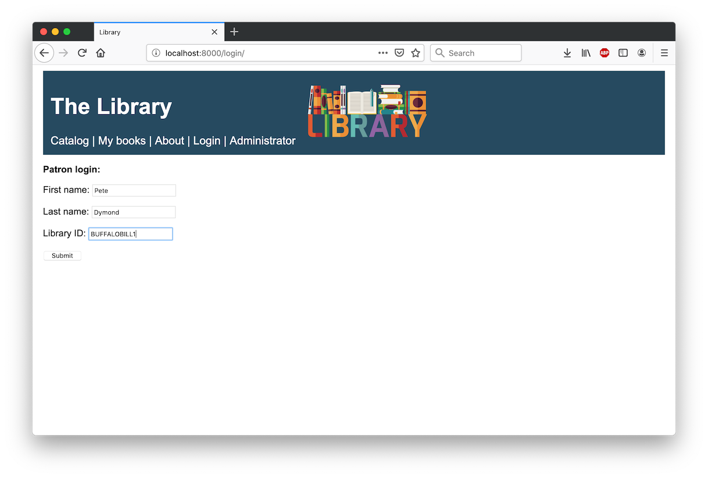
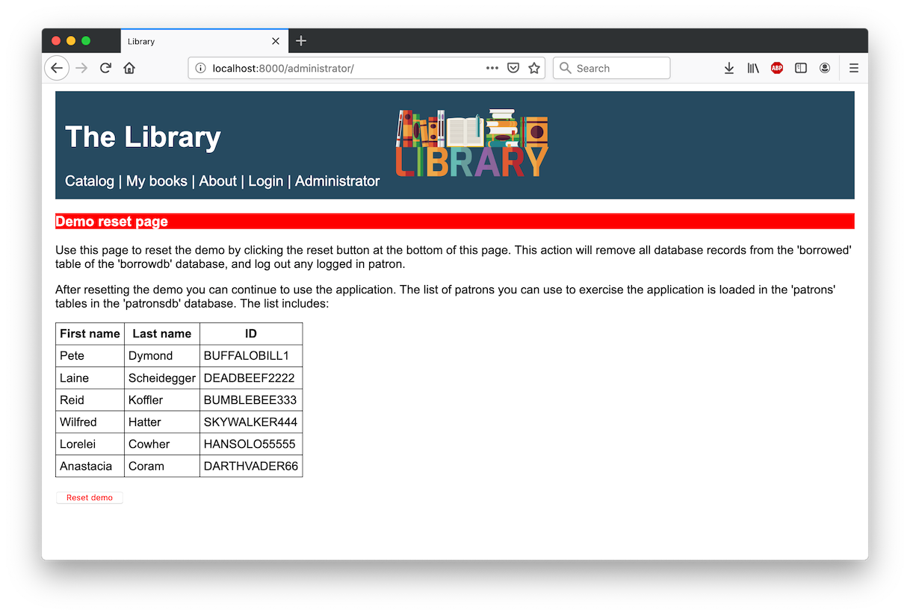
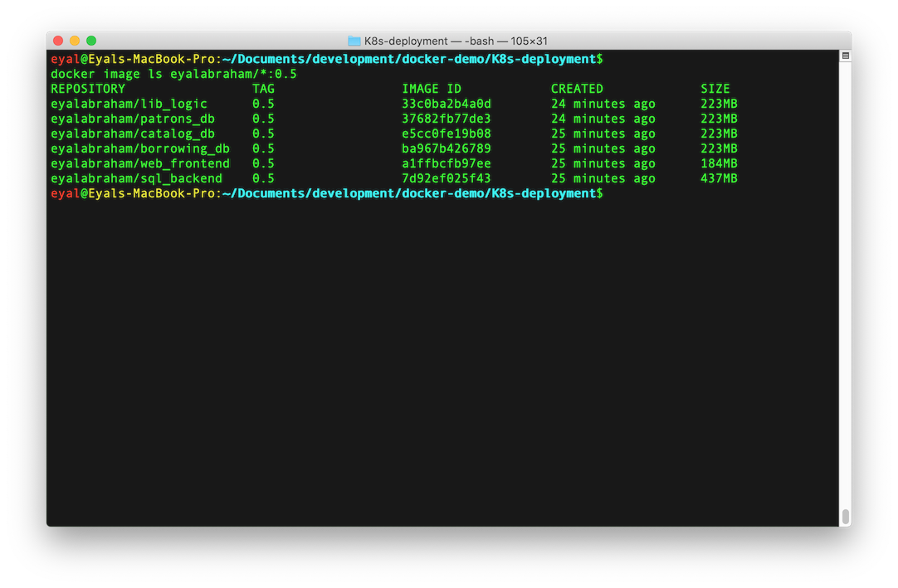
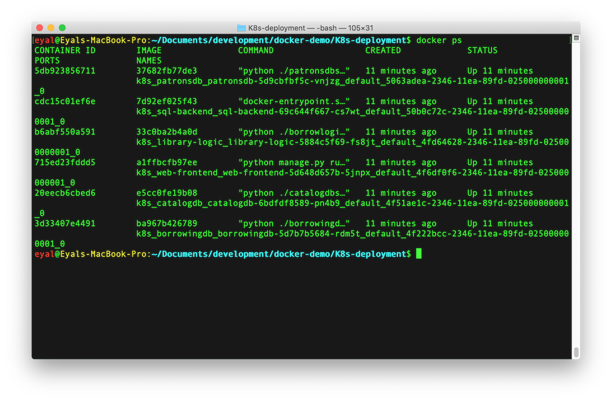
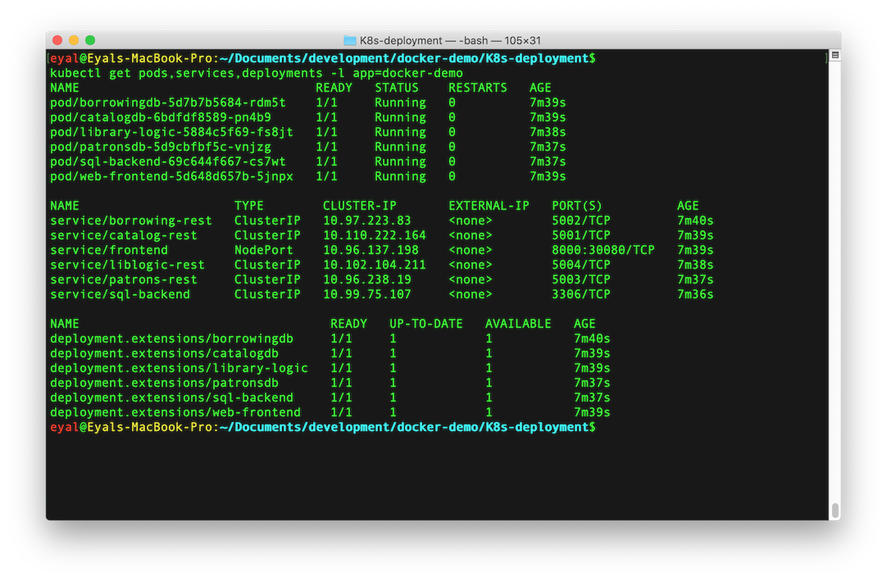
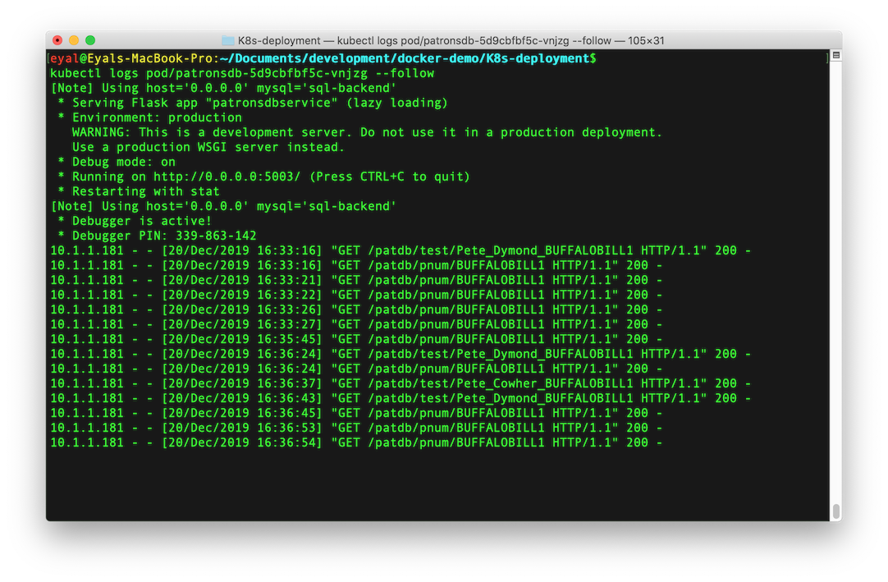

# How to use the demo application

This document outlines proposed steps for a demo or for a self-guided tour of the application. Once you have successfully deployed the application you can use this document to familiarize yourself with the application and some basic underlying docker and Kubernetes tools.  
The library application is simple. Its sole purpose is to be the centerpiece for discussing and demonstrating a Microservices application architecture, and REST API. All running in a Docker Containers environment optionally orchestrated by Kubernetes.

## The demo

For instructions on starting and stopping the demo please refer to the README.md files in the main directory (docker-compose method) or in the K8s-deployment directory (Kubernetes method).

### Launch in a browser

Use your favorite web browser to point to http://localhost:30080/ (if you are running under docker-compose use http://localhost:8000/). All web pages will have an identical header with a set of library pages that you can access. The next sections will review these pages.

### Book catalog

The book catalog is the first page you will access. This page displays a simple catalog of books and includes the author name, a picture of the book's cover, an inventory count, and a Borrow button.

> The books are part of [Project Gutenberg](https://www.gutenberg.org), which is a library of over 60,000 free eBooks.

The book inventory displays two numbers. The first shows the total number of copies that the library has in its inventory, and the second number shows the count of available copies to borrow. As patrons log in and borrow books the available count is reduced. When it reaches zero the Borrow button will not be displayed.



### Patron's borrowed books

The 'My books' page will display the list of a patron's borrowed books. If a patron is logged in, this page will display that patron's borrowed books. If a patron is not logged in, you will be redirected to the login page for you to login as a patron. After a successful login, you will be redirected back to the 'My books' page to view the list of borrowed books.  
To borrow a book, a logged in patron clicks the Borrow button on the catalog page. This action will process the borrow request through the library borrowing logic micro-service, and the result will be displayed on the 'My books' page. The library logic will allow a patron to borrow a book only if: (1) they have less than four books already borrowed, and (2) if they do not already have the same book in their borrowed book list.  
You may log in a patron, borrow books, and then log that patron out. Then, log in a different patron to borrow a similar or different set of books. If you wish to return the demo to its initial state go to the Administration page.



### About

The about page is a simple description of this Microservices application with links to useful resources for further reading.



### Patron login

The patron login page allows you to simulate a login of a patron into the library system. The application contains a list of predetermined patron names (listed in the table below) that you can use to test the login action. Patrons can borrow books from the catalog once they are successfully logged in.



To login a patron, select a patron from the table below and enter the details in the login page, then click the Submit button. If the login was successful you will be redirected to the catalog page. If the login was not successful, or if you have errors in the entry form, you will be prompted with an alert. You will be presented with an option to log out if you access this page with a patron already logged in.

| First Name | Last Name   | Patron ID    |
|------------|-------------|--------------|
| Pete       | Dymond      | BUFFALOBILL1 |
| Laine      | Scheidegger | DEADBEEF2222 |
| Reid       | Koffler     | BUMBLEBEE333 |
| Wilfred    | Hatter      | SKYWALKER444 |
| Lorelei    | Cowher      | HANSOLO55555 |
| Anastacia  | Coram       | DARTHVADER66 |

### Administration

As you probably noticed, there is no way for a patron to return books. In order to keep the demo application as simple as possible, we provided an administration page that implements a demo reset functionality. By clicking the Reset demo button on this page you will remove all borrowed books from all patrons, log out any logged in patron, and return the demo to its initial state.  
This functionality uses the existing REST API services, and implementing a librarian-like administration function is left to you as an exercise :-)



## Docker and Kubernetes command line

Now that you have familiarized yourself with the web application we can take a quick peek under the hood. The following sections will introduce a few easy command line tools that you can use to view the basics of the application's inner workings.

> The command line examples below and the screen shots of their outputs were taken on a MacOS. You should be able to use the same commands even if you are using a different operating system, but the outputs might be slightly different.

### Show the container images

The application uses a Microservices architecture that is built out of six micro-services:

1. MySQL database
2. Catalog database service
3. Patrons' database service
4. Borrowed books database services
5. Library borrowing logic
6. Web front end

Each service is implemented separately, has its REST API interface, and eventually deployed as a container. In order to deploy a container, Docker or Kubernetes need to have the containers' images. To see the six images of the six services type the following on your command line:

```
$ docker image ls eyalabraham/*
```

The output should look something like this.



> You might see different values under the TAG column. These values will be updated when new revisions of this demo are published.

### What's running?

If your application is running then you can view the running containers by executing the following command:

```
$ docker ps
```

The command outputs a list of six containers that are running and executing the code that was encapsulated in the six images listed in the previous section.



### Kubernetes Deployments, Services, and Pods

If you started the application with a Kubernetes deployment by following the ```kubectl apply``` command then you can use the ```kubectl``` utility to inspect the running environment. Start by running the following command that will display the Kubernetes objects associated with the library application:

```
kubectl get pods,services,deployments -l app=docker-demo
```

The command displays information about Pods that encapsulate running containers listed in the previous section, Deployments that maintain the state of the running Pods per environment specification, and finally Services that form the network 'glue' between the containers.



### Trace RESTapi calls

The running containers are processes that run in their isolated OS kernel environment, which are controlled by a Kubernetes object called a Pod. In order to form a working application, these processes need to communicate with each other. For example: when you request to view the library catalog, the web front-end sends REST requests to both the catalog and the borrowed-book services. From the responses, the web front-end forms the view you see on the web page.  
To view the inter-service REST HTTP traffic you need to request Kubernetes to show you the logs that the service code generates. Use the command below to display the logs of your selected Pod. Pick a pod reference from the list in the previous section. When using the ```--follow``` switch the command will not return and will continuously monitor and display new log entries. At this point use the application with the web browser and watch as new REST requests are exchanged with the pod you are watching. To understand what information is being exchanged you can visit the [design.md](design.md) file. To exit the log-watch press the Ctrl-C key combination.

```
kubectl logs pod/<pod name you want to view> --follow
```


